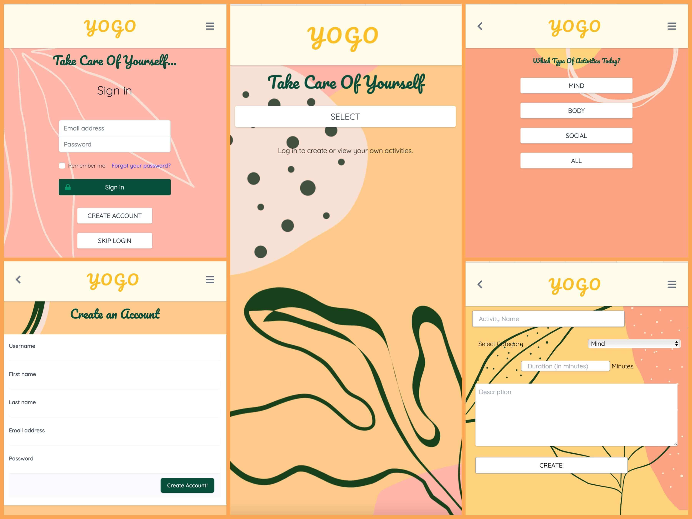

    <h1 align="center"> :sloth: YOGO :sloth: </h1>


### :bar_chart: Table of Contents:

- [Description](#Description)

- [Visuals](#Visuals)

- [Installation](#Installation)

- [Usage](#Usage)

- [Tools](#Tools)

- [Contributing](#Contributing)

- [Profile](#Profile)

### Application Requirements

> Must use `ReactJS` in some way

> Must use a `Node` and `Express Web Server`

> Must be backed by a `MySQL` or `MongoDB `database with a `Sequelize or Mongoose ORM`

> Must have both `GET` and `POST` routes for retrieving and adding new data

> Must deploy this application using Heroku with data. Follow our guide on deploying

> MERN applications to Heroku to do so.

> Must utilize at least `2 libraries`, `packages`, or `technologies` that we haven't discussed

> Must allow for or involve the `authentication` of users in some way

> Must have a `polished` front end/UI

> Must have a folder structure that meets the **_MVC_** paradigm

> Must meet good quality coding standards **_(indentation, scoping, naming)_**

> Must protect `API keys` in `Node` with environment variables

### Description:

```
YoGo is an app to help user prioritize self-care. Self-care is essential for our health and well-being, especially with increased stressors introduced within the last year.
As a user, I want an app that will help me prioritize and manage my self-care practices and routines.
```

### Visuals:



### Installation:

:computer: To deploy an application with a MongoDB database to `Heroku`, you'll need to set up a `MongoDB Atlas` account and connect a database from there to your application. Be sure to use the following guides for support:

- Set Up MongoDB Atlas

- Deploy with Heroku and MongoDB Atlas

### Usage:

:exclamation: `npm run start` make sure to also to do `npm run deploy` to make sure the app run correctly with React.

### Tools:

| Technologies       | :floppy_disk: |
| ------------------ | ------------- |
| React              | Tailwinds CSS |
| Javascript         | Craco.config  |
| Mongoose           | NPM           |
| MongoDB Atlast     | bcrypt        |
| node.js            | cypress       |
| Express            | setupProxy    |
| Git Hub            | Travis.yml    |
| Terminal           | .eslint       |
| Visual Studio Code | Passport      |
| JSON               | manifest.json |

### Contributing:

:wave: Pull requests are welcome. For major changes,<br>
Please open an issue first to discuss what you would like to change.<br>
Please make sure to update tests as appropriate.<br>

### Teams

Jordon Moses [Github](https://github.com/UrkelX)
<br>

James Gould
[Github](https://github.com/nobleburgundy)<br>

Tommy Forde
[Github](https://github.com/tforde4623)<br>

Phillip Merriman
[Github](https://github.com/phillipmerriman)<br>

Mae Kindler
[Github](https://github.com/mkindler)<br>

Alice Piar
[Github](https://github.com/adpir)<br>

### Profile:

:octocat: [GitHub](https://github.com/tforde4623/YoGo)

:purple_circle: [Heroku](https://yogood.herokuapp.com/)
